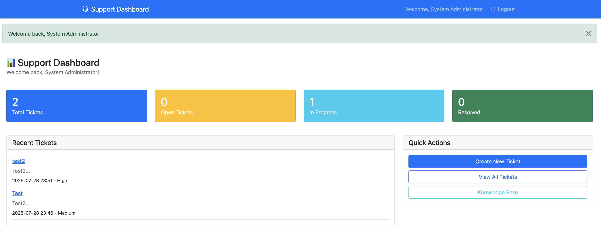
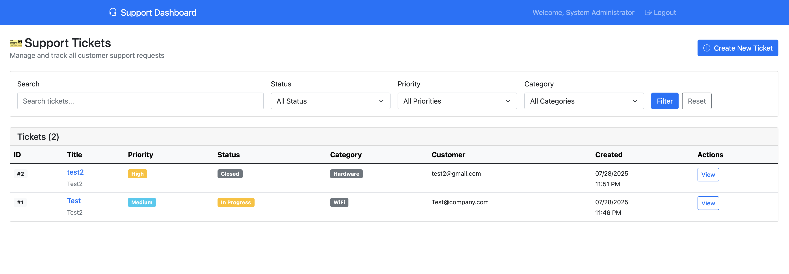
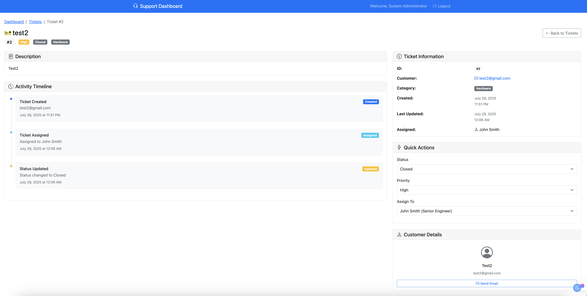
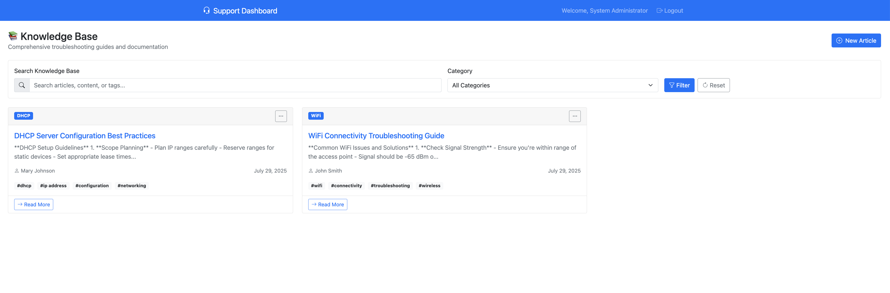

# Customer Support Dashboard

🎯 **Professional web-based ticketing system for network support teams**



*Complete support workflow management with real-time analytics and knowledge base*

## 🚀 Quick Start

```bash
git clone https://github.com/your-username/support-dashboard.git
cd support-dashboard/backend
python -m venv venv && source venv/bin/activate
pip install flask flask-sqlalchemy werkzeug
python init_db.py && python app.py
```

**→ Open http://localhost:8000**  
**→ Login: `admin` / `admin123`**

## 📸 Application Screenshots

<table>
<tr>
<td width="50%">
<h3>🎫 Ticket Management</h3>

<p><em>Advanced filtering, search, and priority management</em></p>
</td>
<td width="50%">
<h3>📋 Ticket Details</h3>

<p><em>Complete timeline, updates, and assignment tracking</em></p>
</td>
</tr>
<tr>
<td width="50%">
<h3>📚 Knowledge Base</h3>

<p><em>Searchable troubleshooting guides and documentation</em></p>
</td>
<td width="50%">
<h3>📊 Analytics Dashboard</h3>

<p><em>Real-time metrics and team performance tracking</em></p>
</td>
</tr>
</table>

## ⚡ Core Features

| Feature | Description |
|---------|-------------|
| 🎫 **Ticket System** | Create, assign, track tickets with priority levels |
| 🔍 **Advanced Search** | Filter by status, priority, category, keywords |
| 📊 **Real-time Analytics** | Interactive charts and performance metrics |
| 📚 **Knowledge Base** | Searchable troubleshooting guides |
| 👥 **Role Management** | Admin, Engineers, Specialists with permissions |
| 📱 **Mobile Responsive** | Professional sidebar navigation, works everywhere |

## 🛠️ Built With

**Backend:** Python Flask + SQLAlchemy | **Frontend:** Bootstrap 5 + Chart.js | **Database:** SQLite

## 🎯 Perfect For

✅ **Network Support Teams** - WiFi, DHCP, VPN troubleshooting  
✅ **IT Helpdesks** - Centralized ticket management  
✅ **Small-Medium Teams** - Easy deployment, no complex setup  

## 🔐 Test Accounts

| User | Password | Access Level |
|------|----------|--------------|
| `admin` | `admin123` | Full system access |
| `jsmith` | `password123` | Senior Engineer |
| `mjohnson` | `password123` | Network Engineer |

---

⭐ **Showcase Project** - Demonstrates full-stack development skills with real-world network support scenarios